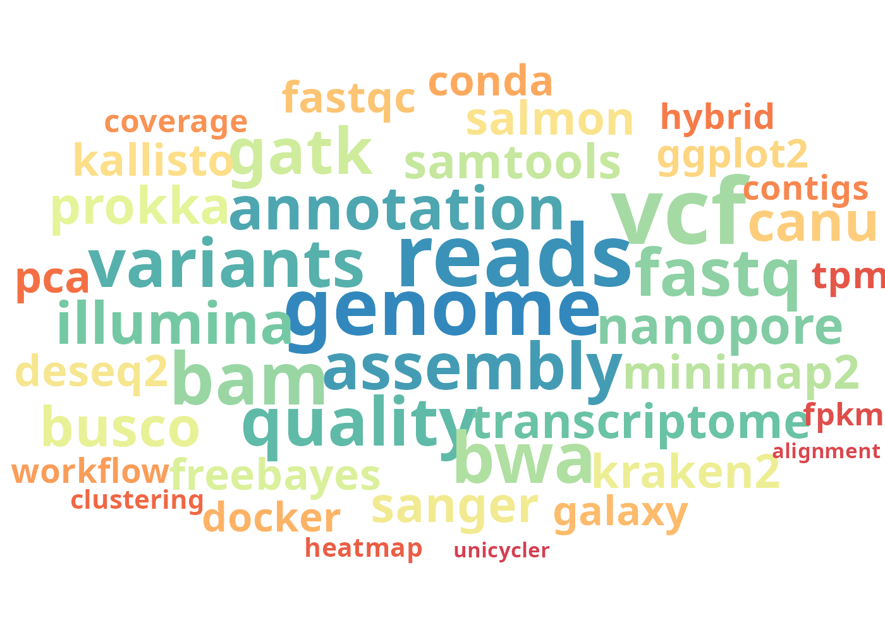
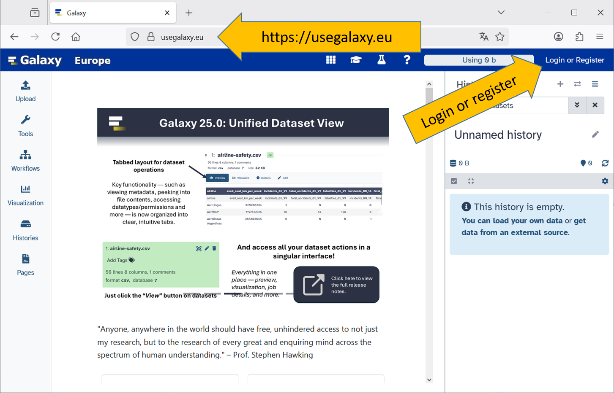

{width="50%" fig-align="center"}

Welcome to this brief introduction to Bioinformatics. It is intended as an introduction to this field and to lay the foundation for the mostly complex and individual analyses.

The contents of this website are for informational purposes only. They are continuously updated and expanded. However, no guarantee can be given for the topicality, correctness, and completeness of the information provided.

If you have any questions or comments, please contact me at: *joerg.wennmann\@julius-kuehn.de*

## Time Schedule

::: {style="max-width: 500px; margin: 0;"}
| 18 Sept     | Session                                        |
|-------------|------------------------------------------------|
| 13:00–13:30 | Welcome & Introduction                         |
| 13:30–14:30 | Lecture: Introduction to sequencing techniques |
| 14:30–14:50 | Break                                          |
| 14:50–15:15 | Lecture: Storage of sequence information       |
| 15:15–15:45 | Hands-on: NCBI SRA                             |
| 15:45–16:00 | Lecture: Introduction to Galaxy                |
| 16:00–16:15 | Break                                          |
| 16:15–17:00 | Hands-on: First steps with Galaxy              |

\
\

| 19 Sept     | Session                                          |
|-------------|--------------------------------------------------|
| 13:00–13:15 | Recap & Questions                                |
| 13:15–14:00 | Hands-on: Upload Data, Read Quality and Trimming |
| 14:00–14:30 | Hands-on: Workflows in Galaxy                    |
| 14:30–14:50 | Break                                            |
| 14:50–15:40 | Hands-on: Metagenomics                           |
| 15:40–16:00 | Lecture: Genome Assembly                         |
| 16:00–16:15 | Break                                            |
| 16:15–17:00 | Hands-on: Genome Assembly                        |
:::

## Required items

To complete this tutorial, you will need access to a Galaxy Platform. There are various Galaxy servers in different regions around the world. Of course, you are free to choose whichever instance you prefer. For this tutorial, I recommend creating an account at [usegalaxy.eu](https://usegalaxy.eu). Accounts are free and can be deleted at any time.

::: comment
<comment-title>Required course items</comment-title> The follwoing course items are required:

-   Bring your own laptop
-   Internet connection
-   An account at usegalaxy.eu
:::

## Create an Galaxy account

Depending on the instance and update of the website, the home page may look slightly different.

::: hands-on
<hands-on-title>Login or Register to Galaxy</hands-on-title>

1.  Open your favorite browser.
2.  Browse to <https://usegalaxy.eu>
3.  Login or register

If you have registered as a new user, don't forget to confirm your email address.
:::

## Laptop or computer

There are no requirements for your laptop! You can use any laptop or computer to participate, as all calculations are performed on the Galaxy server itself.

## Internet connection.

A stable internet connection is required, as a connection to the Galaxy server is necessary in order to perform bioinformatic analysis.

## Websites

-   Galaxy Training Network <https://training.galaxyproject.org>
