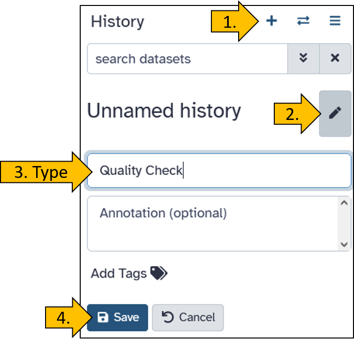
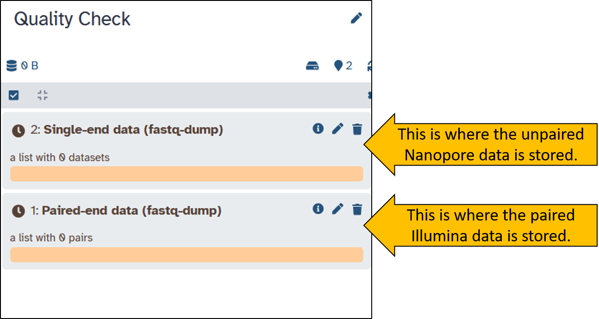
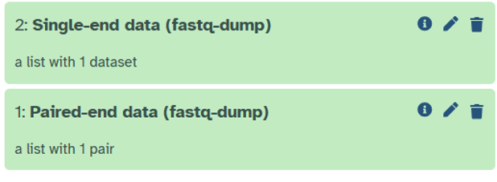
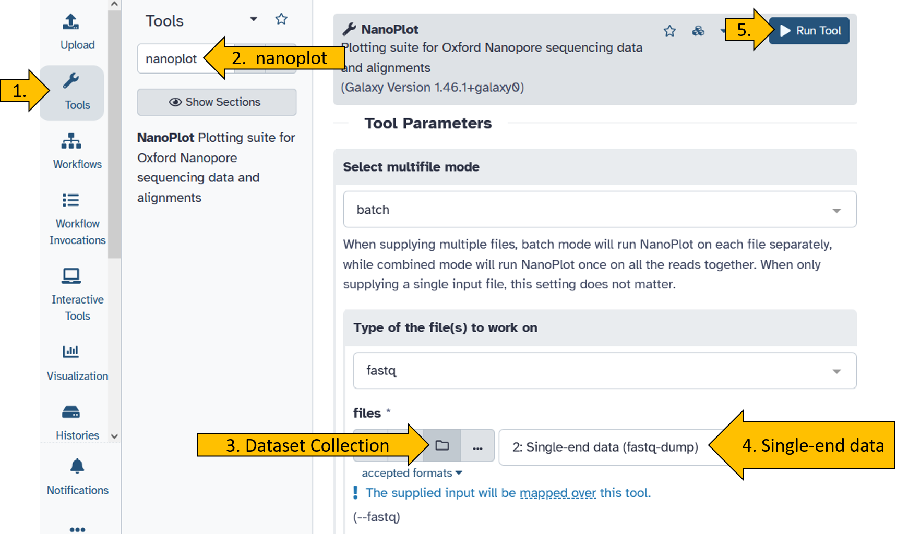
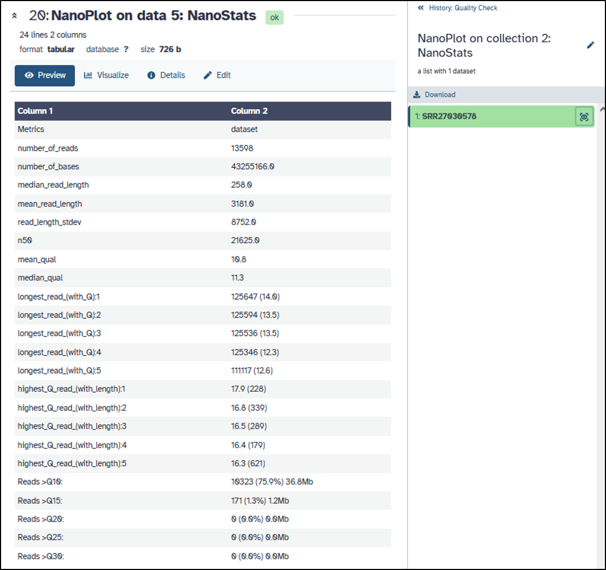
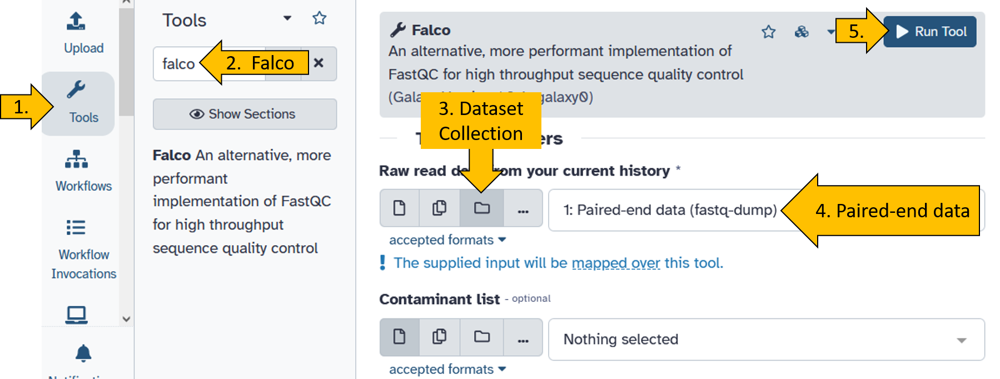
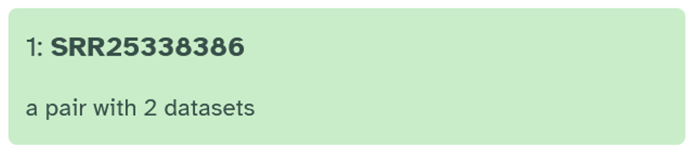
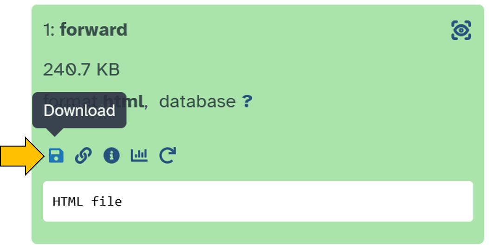

Here, we would like to focus a little more on the topic of assessing read quality. We will see why this is so important when we look at the next dataset, which we will load directly from NCBI SRA to Galaxy.

## Check new Illumina and Nanopore data

It is also possible to upload data directly to NCBI without first storing it on your own PCR. To do this, we will look at two new data sets: `SRR25338386` und `SRR27030578`.

::: hands-on
<hands-on-title>Find out what kind of data it is!</hands-on-title>

Du kannst diese Informationen nutzen, um herauszufinden um was es sich für Daten handelt: [NCBI SRA](https://wennmannlab.github.io/courses/topics/03_ncbi_sra_at_glance/03_ncbi_sra_at_glance.html).
:::

## Create a new history

Create a new empty history and rename it to **Quality Check**.

{width="60%"}

## Upload NCBI SRA data directly to Galaxy.

Hier wie lern how to get the data directly from SRA to a new history.

::: hands-on
<hands-on-title>Upload SRA data to Galaxy</hands-on-title>

First, we select the  `Download and Extract Reads in FASTQ
`{.tool}.

{width="70%"}

Now enter both SRA Accession numbers (`SRR25338386` und `SRR27030578`) and start the tool. We leave all other parameters at their default settings. 

{width="60%"}

An active job should then appear in your history, displayed in grey/orange. This means that the data is being downloaded from NCBI SRA.

{width="60%"}

When the download is complete, both items should be green in the history. We have received two `Collection` containing the sequence data. Collections are useful for preventing the history from becoming overloaded with files. Collections can contain multiple files. Play around with the Collections a little and try to understand what they are all about.

{width="40%"}
:::

## Quality check - Nanopore reads

Before we start working with data, we always check its quality. You should always be sure about the data you are working with.

::: hands-on
<hands-on-title>Quality of Nanopore reads</hands-on-title>

Run the tool `nanoplot`{.tool} on the Nanopore data.

{width="100%"}

When the `nanoplot`{.tool} tool has finished running (turned green), do the following:

- Click on the NanoStat file: {width="50%"}
- Click on the eye to see the result: {width="50%"}

You should get this view of the results for the nanopore reads:

{width="100%"}

::: comment
<comment-title>Can you answer the following questions?</comment-title>

- How long are the Nanopore reads?  
- What is the avarge read quality (Q)?  
- Can you determine the average error probability (P)?  

:::

:::

## Quality check Illumina reads

Since Illumina reads are the most widely used, it is most likely that you will be working with this data. Therefore, we will take a closer look at the quality of Illumina data.

::: hands-on
<hands-on-title>Quality of Illumina reads</hands-on-title>

Run the tool `falco`{.tool} on the Nanopore data.

{width="100%"}

When the `falco`{.tool} tool has finished running (turned green), do the following:

- Click on the `Falco on X: Website` file: {width="50%"}

- Click on the collection: {width="50%"}

- Click on the forward file: {width="50%"}

- Save the file on your computer: {width="50%"}

- `Unzip` the downloaded file.

- Open the `html` file.

::: comment
<comment-title>Can you answer the following questions?</comment-title>

The output should look like the example below. Can you answer the following questions? 

- How long are the Illumina reads?  
- What is the avarge read quality (Q)?  
- Can you say something about the error probability (P)?  



:::

:::

