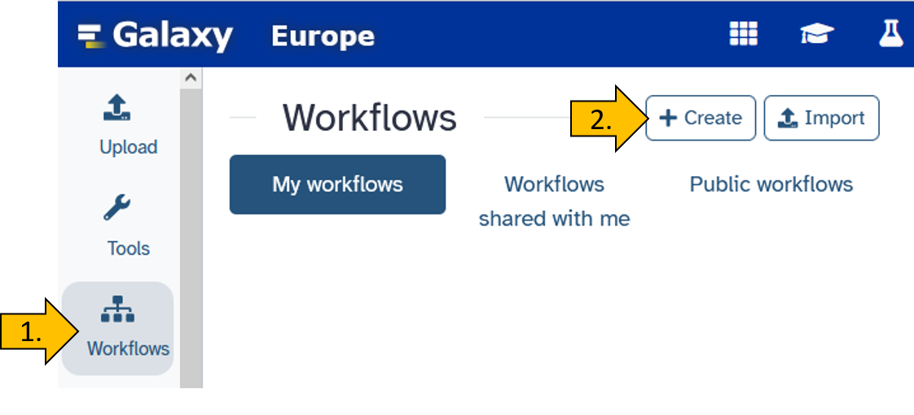
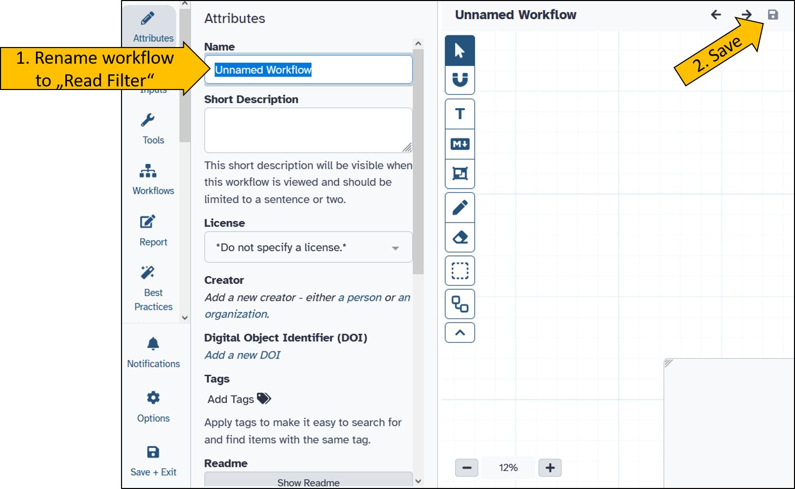
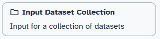
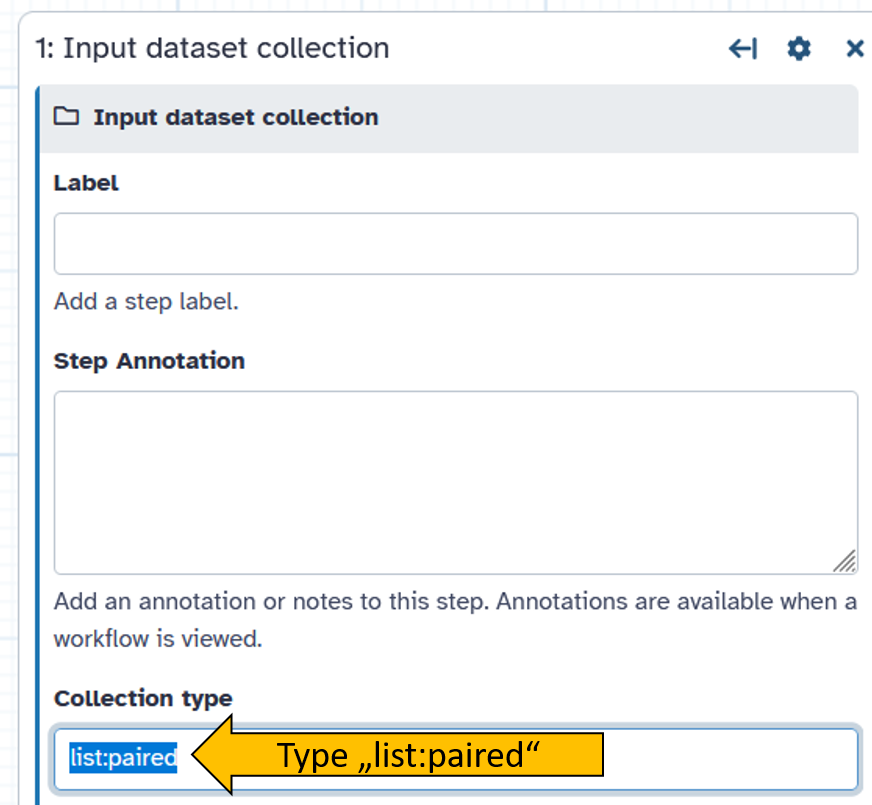
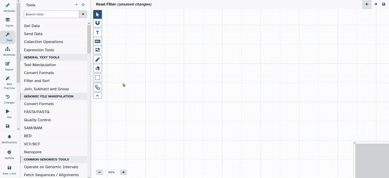
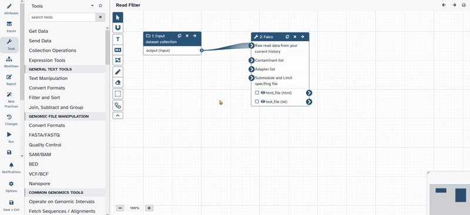
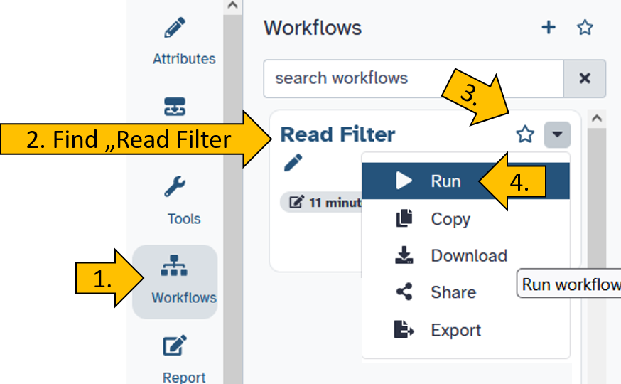
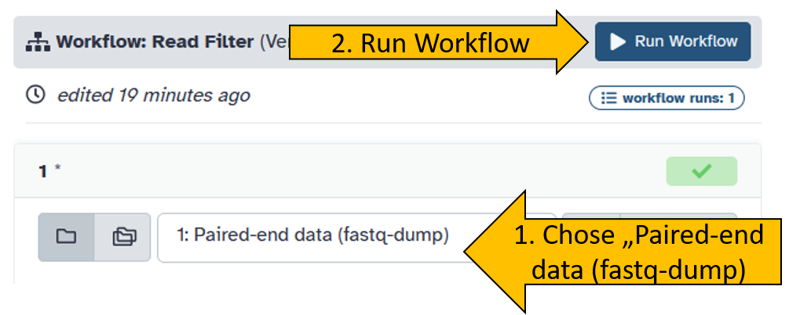
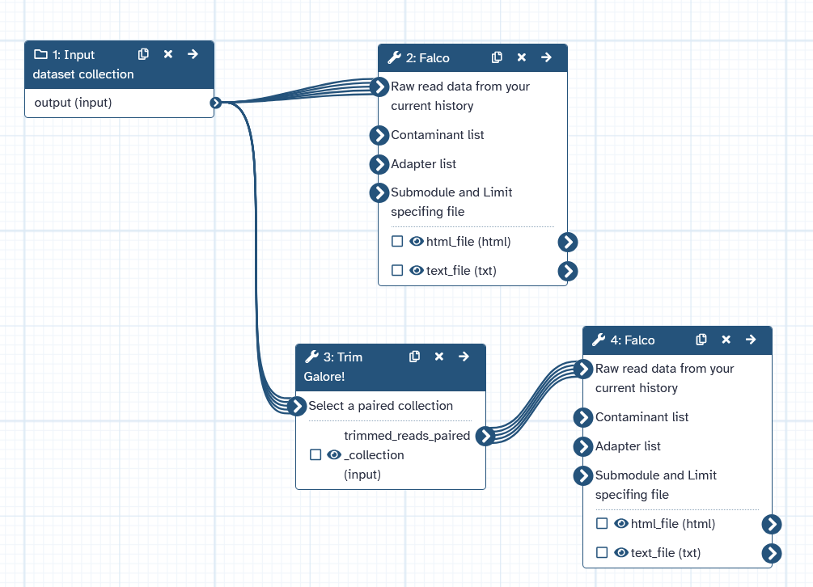

## Are you tired of doing the same thing over and over again?

In bioinformatics, some steps are repeated frequently. These include, for example, checking the quality of reads before and after filtering. It is also undesirable to constantly adjust the parameters manually, as this can quickly lead to errors.  

The strength of Galaxy therefore lies in the fact that analyses can be repeated in a standardized manner.  

For this purpose, so-called workflows have been developed that allow work steps and entire analyses to be performed repeatedly. 

In this chapter, we will learn how to create a simple workflow.

## Create a new workflow

::: hands-on
<hands-on-title>Create a new workflow</hands-on-title>

Chose `Workflow` in the Activity Bar on the very left side of the Galay user interface.

{width="60%"}

After the new workflow is create we can rename it to `Read Filter`.

{width="100%"}

:::

## Adding tools to the workflow

After creating an empty template for a workflow, we still need to fill it with content. To do this, we perform the following steps.

::: hands-on
<hands-on-title>Adding and connecting tools</hands-on-title>

Inside the empty workflow panel perform the following steps:

- Click on `Inputs` on the left in the action panel.
- Chose `Input Dataset Collection` {width="30%"}
- Click and move `1: Input dataset collection` to the desired position.
- Click on `1: Input dataset collection` and on the right side the options menue for the selected tool will open.
- Change Collection type to `list:paired` {width="50%"}
- Next go to tools and chose `Falco`{.tool}.
- The new tool appears inside the workflow window.
- Connect `1: Input dataset collection` with `2: Falco`.

{width="100%"}

- Open up the tool bar again and search for `Trim Galore!`{.tool}
- Click on `Trim Galore!`{.tool} and add it to your workflow.
- Move the tool to the desired position.
- Click on the tool and open the options.
- Change the following parameters of `Trim Galore!`{.tool}
  - Is this library paired- or single end: `Paired Collection`
  - Advanced settings: `Full parameter list`
  - Trim low-quality ends from reads in addition to adapter removal (Enter phred quality score threshold): `30`
  - Discard reads that became shorter than length N: `50`
- Connect `1: Input dataset collection` with `3: Trim Galore!`

{width="100%"}

- Save the workflow by cliching the disk symbol in the top right corner {width="20%"}

:::

## Start the workflow

Now it's time to test the newly created workflow.

::: hands-on
<hands-on-title>Start workflow</hands-on-title>

Click on the left side on `Workflows` and chose your workflow `Read Filter`.

{width="70%"}

Set your workflow parameters by chosing the correct input file: `Paired-end data (fastq-dump)`.

{width="70%"}
:::

::: comment
<comment-title>Advanced task: Quality of the Trim Galore output</comment-title>

Now try to work on the workflow until it completes the following task:

- The workflow takes the paired reads (Illumina) as input
- The `falco`{.tool} tool is launched on the data set.
- The data set is then filtered using `Trim Galore!`{.tool}.
- `falco`{.tool} is run again on the result of `Trim Galore!`{.tool}.

::: {.callout-note collapse="true" title="I need help! *(Click here)*"}
Set the `Trim Galore!`{.tool} options as follows:

{width="100%"}

:::

Additional task:

- What would the workflow look like if you started with the SRA accession number `SRR25338386`? Tip: Use the `Download and Extract Reads in FASTQ`{.tool} tool!

:::

{width="20%"} Congratulations! You have created and started a workflow.

