## What is inside your data?

There are many reasons to perform metagenomic analysis. One reason is to check the quality of the sequencing in terms of its composition. Sometimes you want to sequence a specific organism, but the sample is contaminated with DNA from other organisms (including viruses). This can be due to natural causes or indicate a problem with sample preparation. A metagenomic study is usually performed to determine the taxonomic composition of a sample, i.e., which organisms are present in a sample and in what quantities.

Here we will look at nanopore sequencing `SRR27030578`. This is the sequencing of the silkworm baculovirus (Bombyx mori nucleopolyhedrovirus; BmNPV). The question is whether the sample is pure or whether other viruses or bacteria are also present in the sample. A metagenomic approach that classifies the sequence information is particularly well suited for this purpose.

After classification, we not only obtain information about what the sample might contain, but also have the option of continuing to work only with the desired reads.

## Create a new history

Create a new history and give it a suitable name for metagenomic analysis, e.g., `Metagenomic approach`.

::: {.callout-note collapse="true" title="I need help! *(Click here)*"}
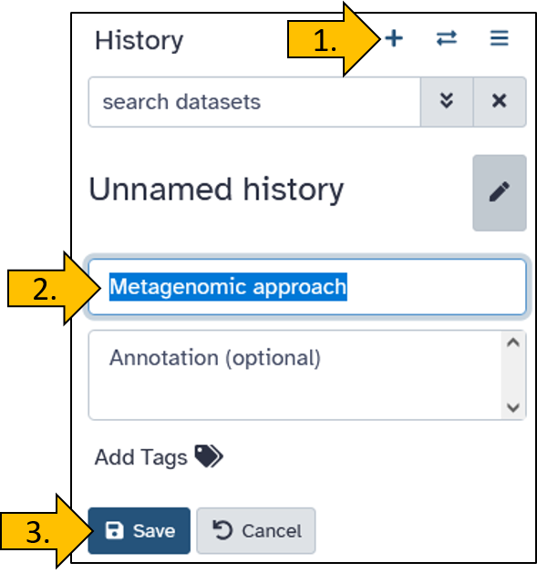{width="50%"}
:::

## Upload data from Zenodo to Galaxy

There are many ways to upload data to Galaxy. Often, the data is stored externally and not on your own PC to avoid unnecessary downloads and uploads. Here, we will practice transferring data directly from Zenodo, a public data repository, to Galaxy.

::: hands-on
<hands-on-title>New history</hands-on-title>

We load the data directly from a data repository called Zenodo into Galaxy. The dataset has the following link: `https://zenodo.org/records/17092436/files/SRR27030578_nanopore.fastqsanger.gz`.

Just before you upload the data, you have the option to name the data set. We will name it `BmNPV-Th2 ONT (SRR27030578)` so that the names are identical for you and in the tutorial.

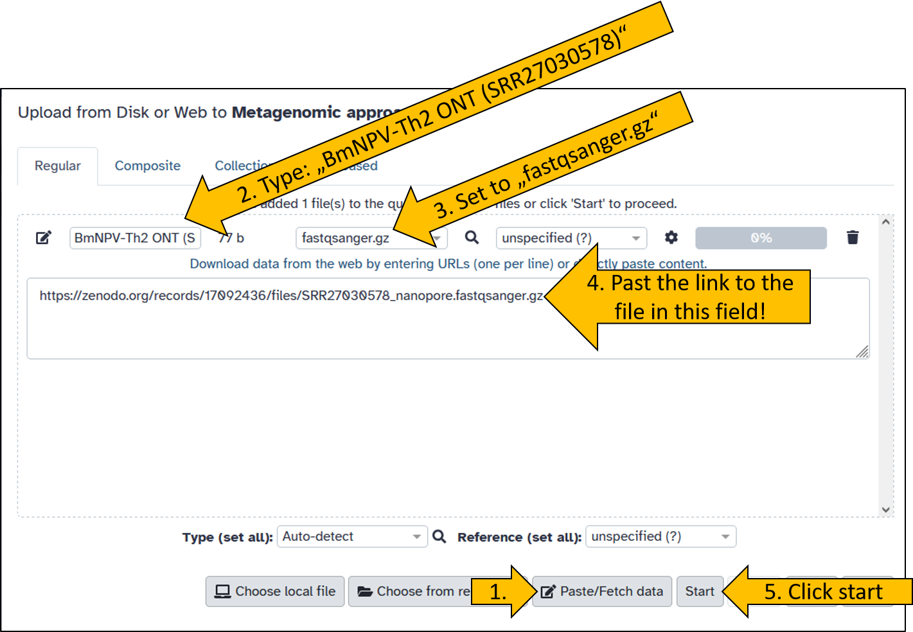{width="80%"}

Wait until the data has been uploaded. It shouldn't take long, as the file is only 44 MB in size.
:::

## Read classication with *kraken2*

The first step in metagenomic analysis is to classify the reads. This is done using the `kraken2`{.tool} tool.

::::: hands-on
<hands-on-title>Read classification</hands-on-title>

By now, you should be familiar with how to search for and launch a tool. Search for `kraken2`{.tool} and open it so that the panel with the settings options opens in the middle.

::: {.callout-note collapse="true" title="I need help! *(Click here)*"}
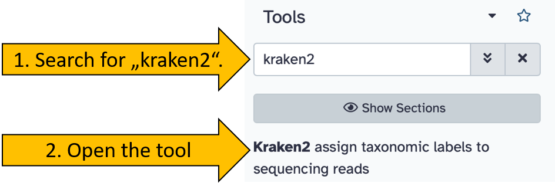{width="80%"}
:::

Set the following options/parameters:

-   Single or paired reads: `single`
-   Input sequences: `BmNPV-Th2 ONT (SRR27030578)`

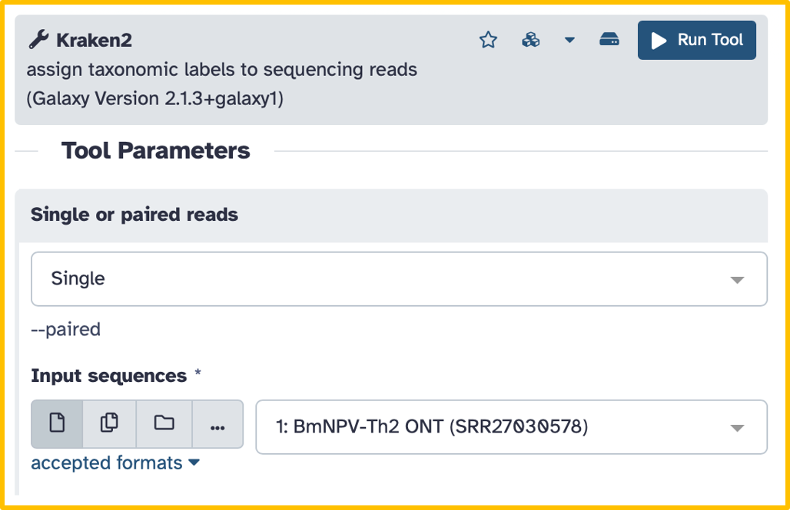{width="80%"}

After that, there are two more options to set for our tutorial:

-   Scroll down until you see the `Create Report` option.
-   Click on `Create Report` to open the submenu
    -   Print a report with aggregrates counts/clade to file: `Yes`

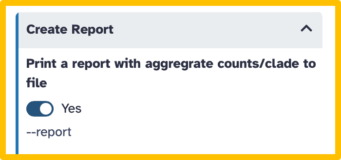{width="50%"}

::: {.callout-note collapse="true" title="I need help! *(Click here)*"}
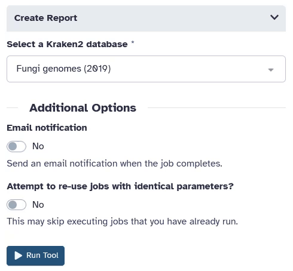{width="50%"}
:::

For classification, kraken2 requires a database based on previously sequenced sequences of organisms. Select the following database:

-   Select a Kraken2 database: \`Prebuilt Refseq indexes: PlusPF (Standard plus protozoa and fugni) (Version: 2024-01-12 - Downloaded: 2024-07-15T185612Z)

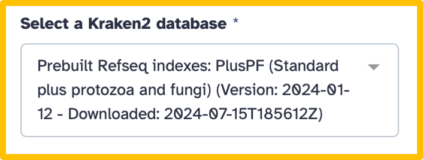{width="50%"}

Once the parameters have been set, we can start the program.

-   Click on run tool 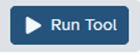{width="15%"}

It takes a little while for the kraken2 tool to complete the analysis (5 to 10 min).

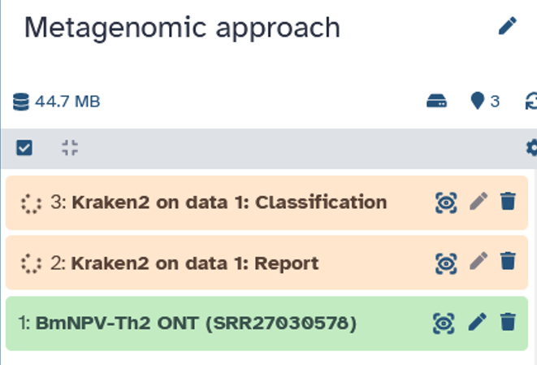{width="50%"}
:::::

::: warning
<warning-title>Parameters for kraken2</warning-title>

There are many parameters that can be set in `kraken2` that can have a significant impact on the result. The `Confidence` parameter is particularly important and should be chosen with care. If you are interested in learning more about this topic, find out more about [kraken2](https://github.com/DerrickWood/kraken2).
:::

## *kraken2* report file

After kraken2 has run, we download the report file. We will now take a closer look at it in order to evaluate the data.

::: hands-on
<hands-on-title>Report download </hands-on-title>

Open the report file by clicking on it in your history. Then download the file by clicking on the disk icon.

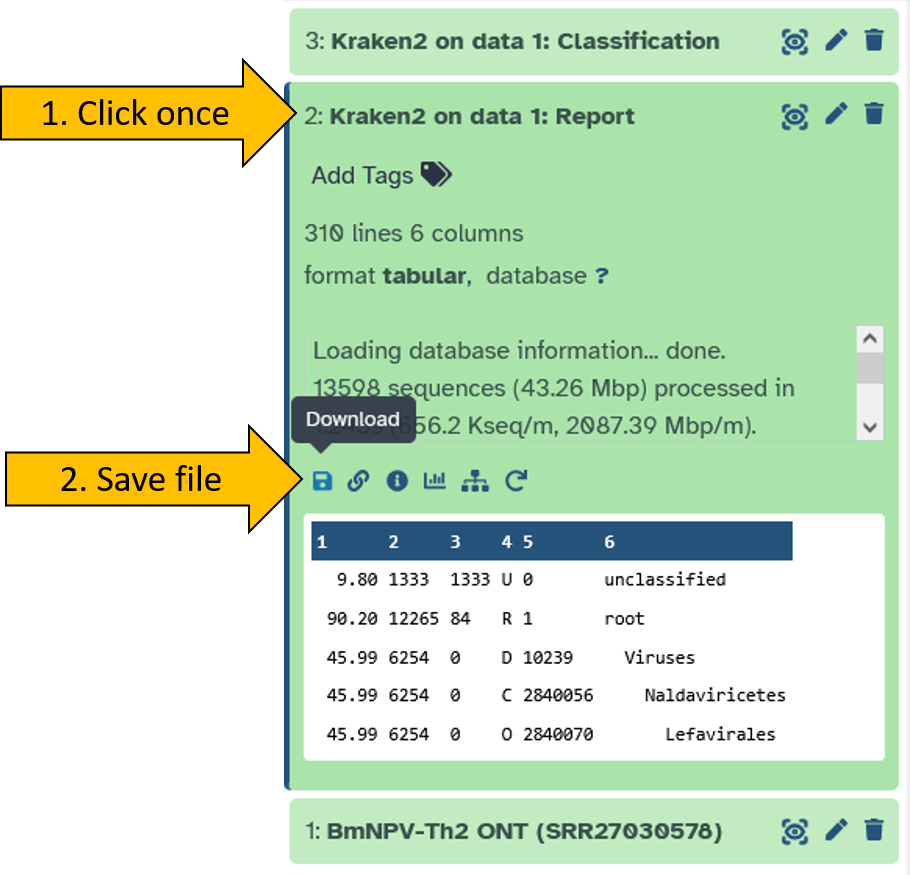{width="70%"}

Open the report file using the Windows `Editor`{.tool}.

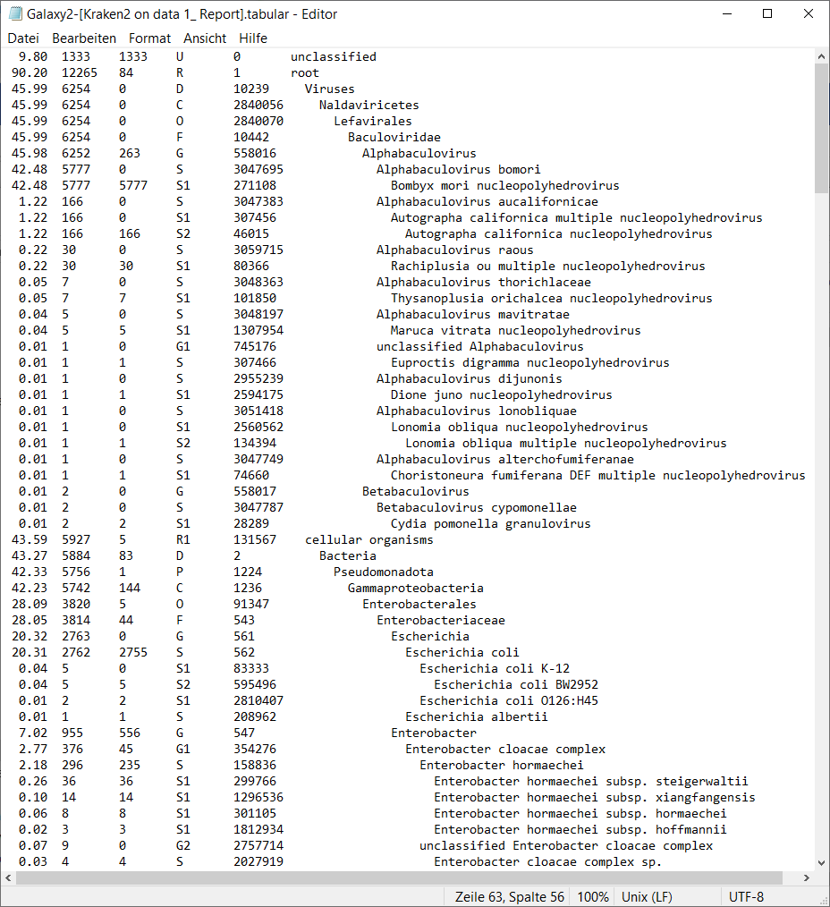{width="70%"}
:::

The report file is organized in six columns according to a specific format:

-   Percent (percentage of reads)\
    Percentage of reads (or k-mers) in this taxonomic clade including all its subclades.

-   Number of reads per clade Number of reads assigned to this clade or any of its subclades.

-   Number of reads per taxon only Number of reads assigned directly to this taxon only (not including children).

-   Rank code\
    Taxonomic rank:

    -   U = unclassified\
    -   R = root\
    -   D = domain\
    -   K = kingdom\
    -   P = phylum\
    -   C = class\
    -   O = order\
    -   F = family\
    -   G = genus\
    -   S = species\
    -   S1, S2, … = lower ranks (strain, subspecies)

-   NCBI taxon ID\
    Unique taxonomy identifier from the NCBI Taxonomy.

-   Scientific name

## Visualization using *krona*

Looking at tables is usually tedious and not very intuitive. Fortunately, there are tools available for displaying metagenomic results that allow us to analyze the data easily.

### Convert kraken report file

To visualize the `kraken2`{.tool} output the data using the `krona`{.tool} tool, we first need to convert the report file.

There is a suitable tool for this called `Krakentools: Convert kraken report file`{.tool}.

:::: hands-on
<hands-on-title>Convert kraken2 report file</hands-on-title>

-   Searchfor and open the `Krakentools: Convert kraken report file`{.tool} tool.
-   Set the following parameter:
    -   Kraken report file: `Kraken2 on data X: Report` (X can be any number depending on your history).

::: {.callout-note collapse="true" title="I need help! *(Click here)*"}
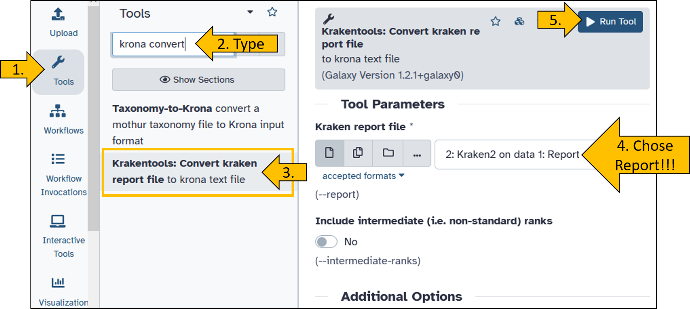{width="80%"}
:::
::::

### Running krona

Next, we can start and view the converted report file with `krona`{.tool} This will greatly simplify the viewing of the results.

:::: hands-on
<hands-on-title>View report with krona</hands-on-title>

-   Search for the `Krona pie chart`{.tool}
-   Open the tool to set the parameters:
    -   What is the type of your iput data: `tabular`
    -   Input file: `Krakentools: Convert kraken report file on data X`
-   Click on `Run Tool`

::: {.callout-note collapse="true" title="I need help! *(Click here)*"}
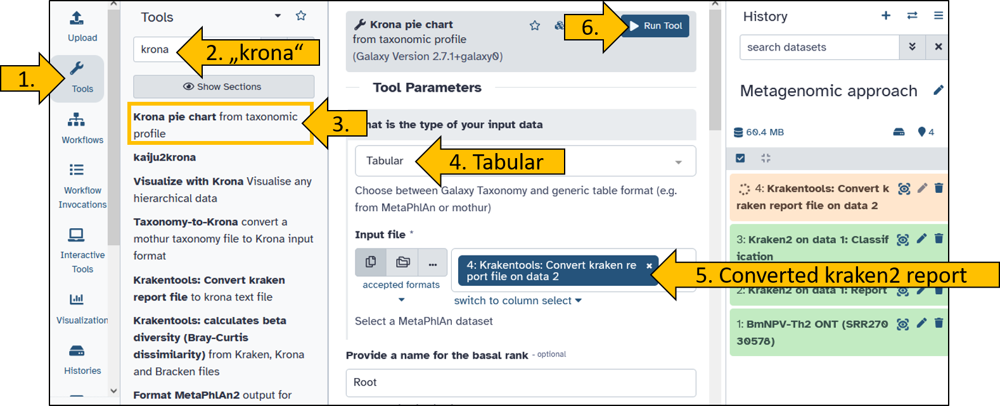{width="80%"}
:::

Once the krona tool is ready, you can view the results. The visualization is generated as an HTML document (a web page file that your browser can open and display, including interactive elements) and can be viewed directly in Galaxy.

-   Click on the eye icon to view the `Krona pie chart`.

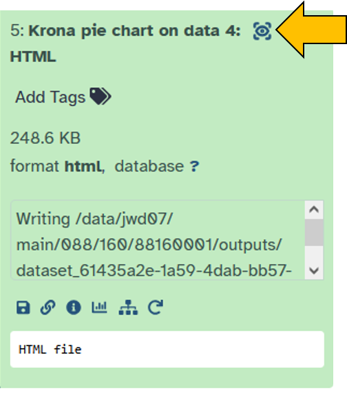{width="40%"}
::::

You will now see the result of krona as an interactive interface. Play around with it to familiarize yourself with it.

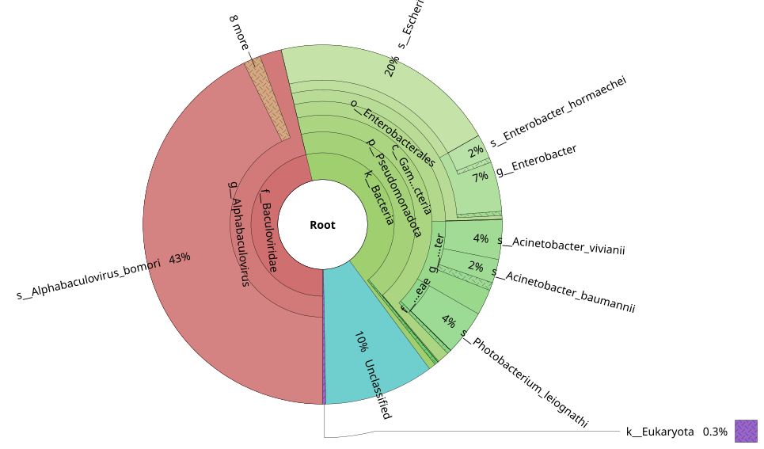{width="90%"}

::: comment
<comment-title>What is inside the sample?</comment-title>

Take a look at the krona pie chart. Can you see what else is present in the sample? The virus BmNPV, which was the target of the sequencing, is referred to as Alphabaculovirus bomori in the visualization. Would you describe this sample as pure?
:::

### Challenge: Advanced kraken2 workflow

Hier möchte ich dir die Möglichkeit geben die zuvor durchgeführte Analyse mit kraken2 zu erweitern.

:::: hands-on
<hands-on-title>Challenge</hands-on-title>

-   Create a new workflow
-   Give the workflow a suitable name
-   Create a workflow that automatically performs the following tasks:
    -   Input: `Input Dataset - Single dataset input`
    -   Input file is `BmNPV-Th2 ONT (SRR27030578)` (or another file of your choice)
    -   The input is forwarded to `kraken2`{.tool}
    -   The parameters are as described above.
        -   Set the confidence score: `0.5`
        -   Select a kraken2 database: `Prebuilt: Refseq indexes: core_nt (Very large collection ...)`
    -   The `Krakentools: Convert`{.tool} tool converts the report file.
    -   The converted file is visualized with `krona`{.tool}.
-   The workflow shoud consist out of four steps.
-   Save the workflow
-   Start the workflow by chosing the input file.

::: {.callout-note collapse="true" title="I need help! *(Click here)*"}
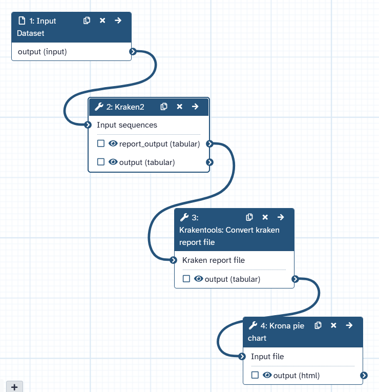{width="100%"}
:::
::::

## Visualization using *Sankey Plot*

The next tool I would like to introduce for displaying classification is available online. The graphic created here is called a Sankey plot created by tool `Pavian`{.tool}. The tool requires the `kraken2 report file` as input!

The tool `Pavian`{.tool} is a R shineyapp and can be found at this address: <https://fbreitwieser.shinyapps.io/pavian/>.

::: reference
<reference-title>Pavian</reference-title>

Breitwieser, F., Salzberg (2020) Pavian: interactive analysis of metagenomic data for microbiome studies and pathogen identification. *Bioinformatics*, Volume 36, Issue 4, Pages 1303-1304\
https://doi.org/10.1093/bioinformatics/btz715
:::

::: hands-on
<hands-on-title>Running Pavian</hands-on-title>

Do you remember the kraken2 report file that we have saved from your history?

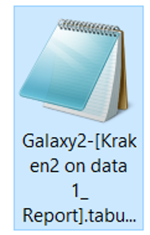{width="10%"} [You can also find the file here for download.](kraken2_report_file/Galaxy2-%5BKraken2%20on%20data%201_%20Report%5D.tabular)

-   Visit the following homepage <https://fbreitwieser.shinyapps.io/pavian/>
-   Upload the kraken2 report file `Galaxy2-[Kraken2 on data 1_ Report].tabular`.

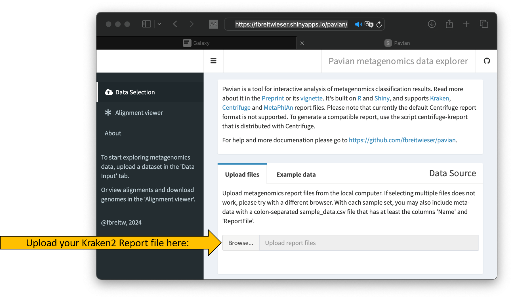{width="100%"} The upload should start automatically and the tool's interface should change slightly.

-   Once the upload is complete, click on Sample.

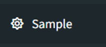{width="20%"}

The Sankey plot should then appear and you can begin analyzing the data.

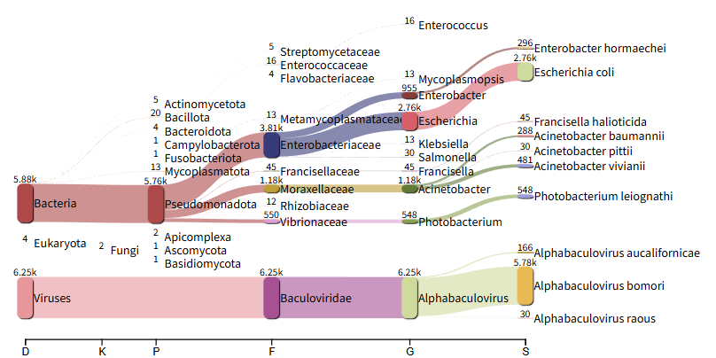{width="100%"}
:::

## Extraction of classified reads

After classification, the question arises as to whether I can continue working with only a specific group (= taxon) of reads.

The answer is yes.

The trick is the `classification file` that was generated alongside the report. It contains information about which read was assigned to which taxon. This allows you to keep only the reads that correspond to a desired taxon.

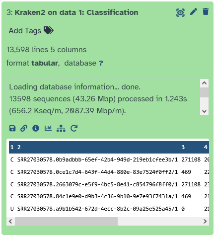{width="50%"}

Let's start by extracting all reads that have been assigned to the taxon `Baculoviridae` (a virus family of dsDNA viruses). To do this, we need to take another look at the `Kraken2 report file`.

::: hands-on
<hands-on-title>Read extraction</hands-on-title>

Schauen wir uns das Report file von kraken2 tool noch einmal genauer an. In der 5ten Spale

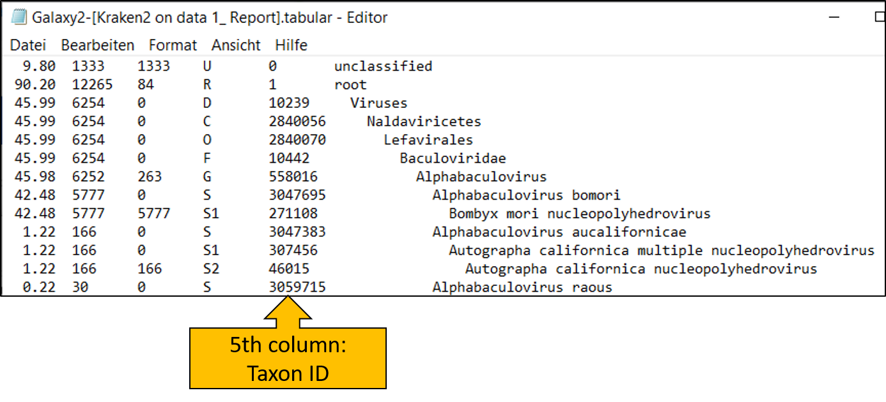{width="100%"}

Let's take another closer look at the report file from the `kraken2`{.tool} tool. The fifth column contains the `taxon ID`, which we will now use.

Here we see that `Baculoviridae` has the ID `10442`. We will need this number for the next step!

-   Search for tool `krakentools: Extract Kraken Reads By ID`{.tool}
-   Click to open the tool
-   Set the following parameters:
    -   FASTQ/A file: `BmNPV-Th2 ONT (SRR27030578)`
    -   Results: `Kraken2 on data x: Classification`
    -   Report: `Kraken2 on data x: Report`
    -   Taxonomic ID(s) to match: `10442`
    -   Scroll down and toggle the following options to `Yes`:
        -   Output as FASTQ: `Yes`
        -   Include children: `Yes`

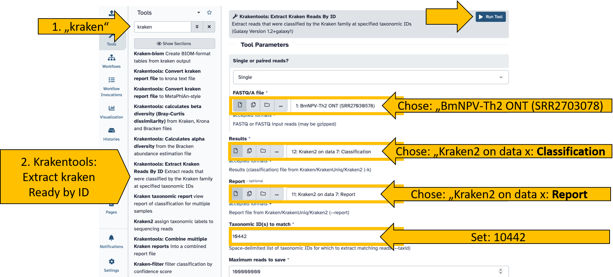{width="100%"}

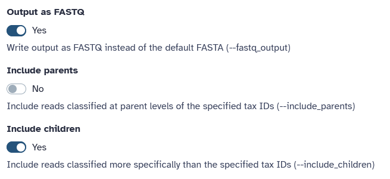{width="80%"}

Start the tool and wait until it has completed the read extraction.

You should then see the reads that have been assigned only to the taxon (and more specifically) in the history.
:::

{width="20%"}

Congratulations, you should have your reads metagenomically analyzed, classified, and extracted.
