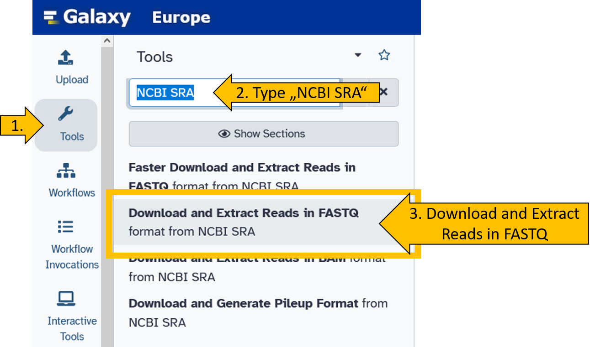
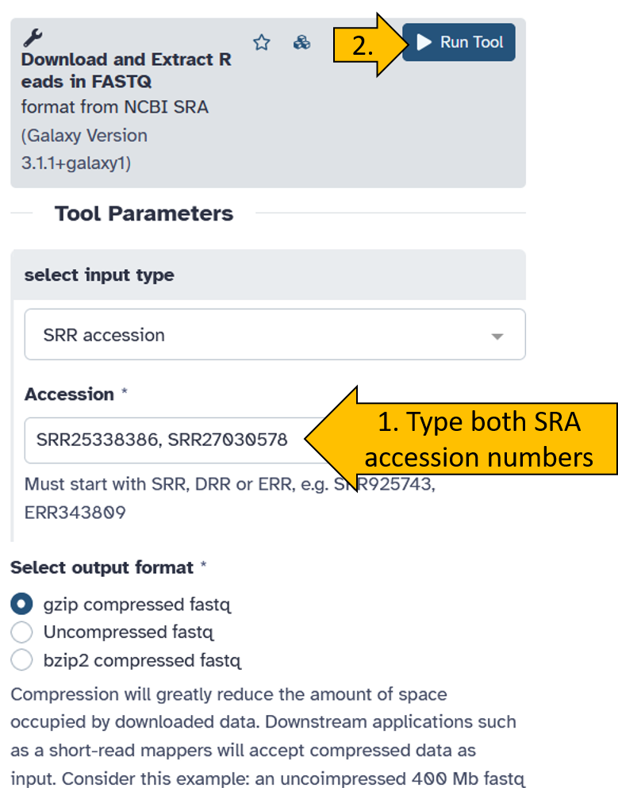
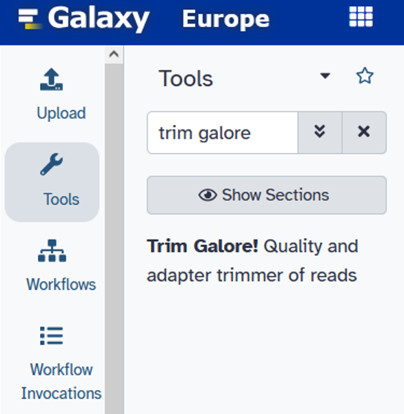
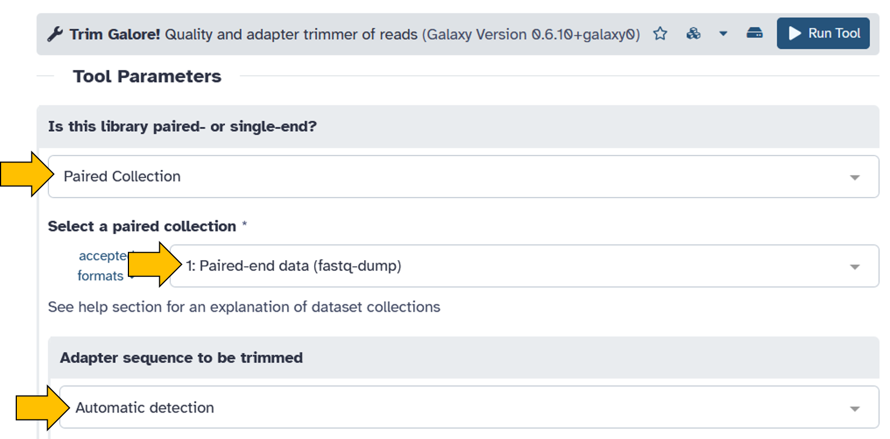
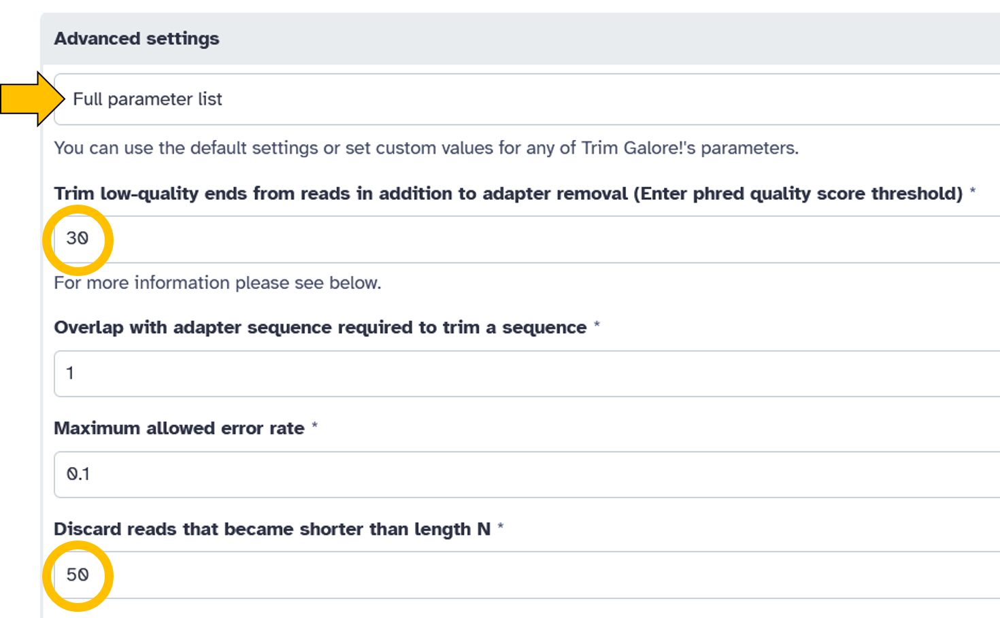
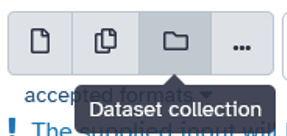
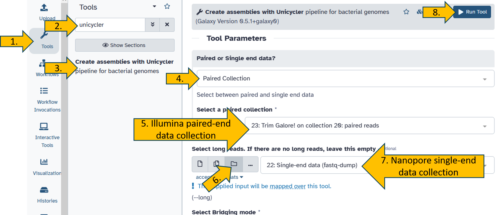

## The theory of genome assembly

:::: lecture
<lecture-title>Assembly (\~30 min)</lecture-title>

Below you can see a preview of a presentation from the Galaxy Training Network (GTN). You can navigate through the presentation using the arrow keys: Next slide: `→`; Previous slide: `←`.

[{.flag width="25px"} Japanese version](https://training.galaxyproject.org/training-material/topics/assembly)



::: reference
<reference-title>Reference</reference-title> This presentation is from the Galaxy Training Network (GTN): [*Introduction to Galaxy*](training.galaxyproject.org/training-material/topics/assembly/tutorials/general-introduction/) Lizenz: [CC BY 4.0](https://creativecommons.org/licenses/by/4.0/).
:::
::::

The science of assembling a genome is complicated, and there are many ways to attempt it. With the various sequencing technologies, different tools (assemblers) have also been developed that exploit the strengths of short reads (Illumina = short but extremely high accuracy) and long reads (Nanopore and PacBio = stretching long part of the genome).

At this point, I will only introduce one tool that is particularly well suited for assembling the circular genomes of bacteria, as it was developed specifically for this purpose.

Nevertheless, I hope to provide a small but sufficient insight into the theory and complexity of genome assembly.

The assembler we use for genome reconstruction is unicylcer\`{.tool} We already have worked with the data we use for genome assembly and we will recycle the same data just for training purposes.

::: comment
<comment-title>Why do we use this data?</comment-title>

Assembly is a computationally intensive process that can take minutes, hours, days, or longer, depending on the complexity of the genome. Since we don't have the time to wait hours for a result, we will limit ourselves to the genome of Bombyx mori nucleopolyhedrovirus. The genome is 130,000 bp long and circularly closed.

The virus belongs to the large dsDNA viruses and the genome resembles a plasmid or a very small bacterial genome. This makes it perfect for practice because the assembly only takes minutes, which is suitable for this course.
:::

## Create a new history

Create a new empty history and rename it to `Unicycler assembly`.

{width="60%"}

## Upload NCBI SRA data directly to Galaxy.

Upload the data to your history from NCBI SRA (or transfer it from your other history).

::: hands-on
<hands-on-title>Upload SRA data to Galaxy</hands-on-title>

First, we select the `Download and Extract Reads in FASTQ`{.tool}.

{width="70%"}

Now enter both SRA Accession numbers (`SRR25338386` und `SRR27030578`) and start the tool. We leave all other parameters at their default settings.

{width="60%"}

An active job should then appear in your history, displayed in grey/orange. This means that the data is being downloaded from NCBI SRA.

{width="60%"}

When the download is complete, both items should be green in the history. We have received two `Collection` containing the sequence data. Collections are useful for preventing the history from becoming overloaded with files. Collections can contain multiple files. Play around with the Collections a little and try to understand what they are all about.

{width="40%"}
:::

## Quality and adapter trimming (Illumina)

Now we use `Trim Galore!`{.tool} to quality filter and adapter trim the Illumina data.

:::: hands-on
<hands-on-title>Removing bad quality bases and adapters (Illumina data)</hands-on-title>

To filter the quality and remove the adapters, we use the tool `Trim Galore!`{.tool}. By now, you should be familiar with selecting tools in Galaxy. You should also know how to select the parameters of the tools in the `Centre Panel`.

Start the tool `Trim Galore!`{.tool}. with the following parameters:

-   Chose `Trim Galore!`{.tool} from the tools panel.
-   Click on `Trim Galore!`{.tool}
-   Set the following parameters (*leave everything else as default*):
    -   Is this library paired- or single-end: `Paired Collection`
    -   Select a paired collection: `Paired-end data (fastq-dump)`
    -   Adapter sequence to be trimmed: `Automatic detection`
    -   **Advanced settings** = `Full parameter list`:
        -   Trim low-quality ends from reads in addition to adapter removal (Enter phred quality score thresold): `30`
        -   Discard reads that became shorter than length N: `50`
-   Click on `Run Tool` to filter your Illumina paired-end dataset.

{width="40%"}

::: {.callout-note collapse="true" title="I need help! *(Click here)*"}
Set the `Trim Galore!`{.tool} options as follows:

{width="100%"}

{width="100%"}
:::
::::

## Unicycler assembly

Now we use the tool `unicycler`{.tool} to reconstruct the genome.

`Unicycler`{.tool} is a tool that leverages the strengths of Illumina and Nanopore data to perform hybrid assembly. It is also possible to perform Illumina or Nanopore assembly alone.

However, since we have both, we utilize both data sets.

::: reference
<reference-title>Reference: Unicycler</reference-title>

Here you can find more information about the Unicycler tool and how it works: <https://github.com/swlong/Unicycler>
:::

The tool is already somewhat older, and there is now a successor called `autocycler`{.tool} However, we are sticking with `unicycler`{.tool} because it works excellently and is still frequently used today.

::: hands-on
<hands-on-title>unicycler</hands-on-title>

Search and open the `unicycler`{.tool} tool.  
The the following parameters:  

- Paired or Singe end data: `Paired Collection`
- Select a paired collection: `Trim Galore! on collection x: paired reads`
- Select long reads. If there are no long reads, leave this empty: `*Switch to: Dataset Collection*`
{width="30%"}

- Select long reads. If there are no long reads, leave this empty: `Single-end data (fastq-dump)` 

::: {.callout-note collapse="true" title="I need help! *(Click here)*"}
Set the `Trim Galore!`{.tool} options as follows:

{width="100%"}

:::

:::

{width="20%"}

Congratulations, you have started your assembly.Lets

